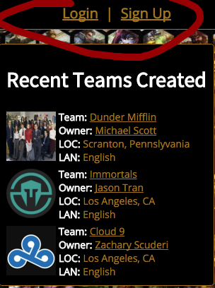
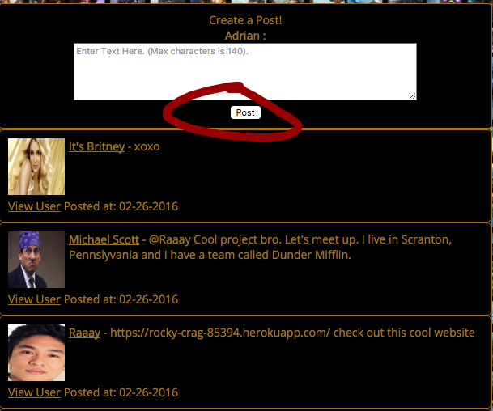

#Team of Legends

## Developer: Adrian Nuyda

###Description:

[Trello Link](https://trello.com/b/92O0Rgos/project-2-team-of-legends)

I built an app that would help build a community of League of Legends players to come together to form local teams, talk about League of Legends, or anything relating to eSports or whatever they desire. Users will be able to find other local players that want to create a competitive team to play against other local teams or teams via online on the rift. 

Users will be able to create an account and will have to provide some important information such as their name, location, language, position, skill level, DOB, type of transportation, and in-game screen name. From there, users will have the ability to browse other users' information and can also create a team to play competitevely, <i>(or casually)</i>, against other local teams or online. After creating a team, the user who is managing the team can find other users and will be able to select/invite someone into their team, while users without a team will be able to browse other teams that are in need of players.

#####Technologies used:
<li> Ruby
<li> Ruby on Rails
<li> HTML
<li> CSS
<li> Heroku

##Table of Contents
<ol>
	<li> Design Approach
	<li> How to Install
	<li> How to Use
	<li> Unsolved Problems/Future Features
</ol>
-

####<b>1. <u>Design Approach</u></b>

As a twitter user, I wanted to build my app with a twitter layout while mixing in some colors and styles used by the original League of Legends website. I also asked a friend to create the logo for me. In addition, it was a great experience to work with a graphic designer to help make my app look better with custom logos while I was building the app. 

-
####<b>2. <u>How to Install</u></b>

1. Open up your browser.
2. Copy and paste this link to your url browser: [https://afternoon-tundra-30908.herokuapp.com/](https://afternoon-tundra-30908.herokuapp.com/)

-
####<b>3. <u>How to Use</u></b>
Step 1. Create an account by signing up to be authorized to post and/or create a team.

 

Step 2. Post! 

####<b>4. <u>Unsolved Problems/Future Features to Implement</u></b>

Due to time constraints, I wasn't able to prevent a User from creating more than one team. He/She should only belong to one team. Also, I wasn't able to implement a feature where users can join a team or a user can invite a user to join their team.

When I have time, I would also like to implement a feature where users can create local tournaments and only a certain amount of teams can enter the tournament based on their overall skill level as a team and/or the tournament's format type. 

